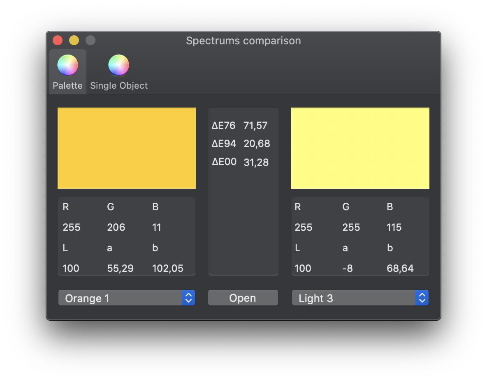
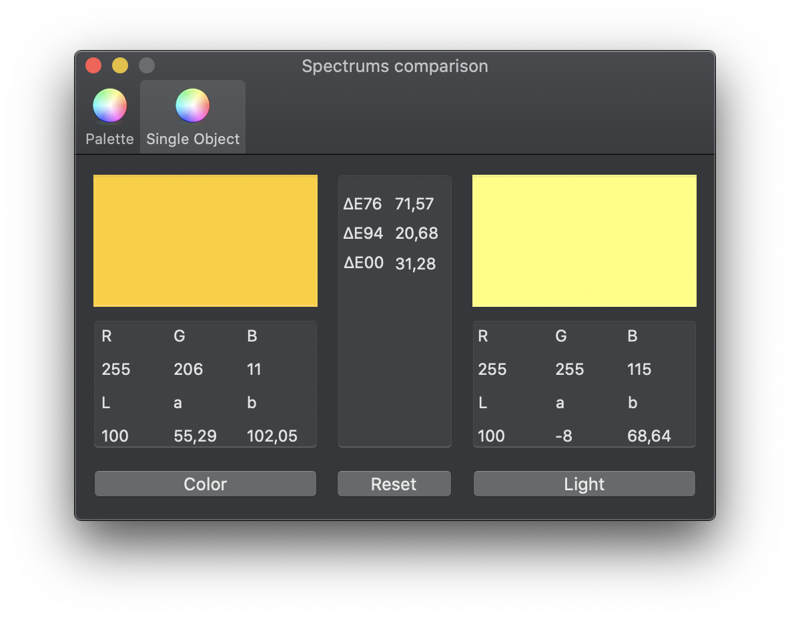

# Spectrums-comparison

Spectrums comparison is an application which converts color spectrums to Lab and RGB and calculates ∆E76, ∆E94 and ∆E00.

## How it works:

### Palette
1. Upload CXF palette
2. Choose object and light
3. App will calculate ∆E76, ∆E94 and ∆E00. ([Wiki](https://en.wikipedia.org/wiki/Color_difference))

### Single object/light
1. Upload object's spectrum
2. Upload light's spectrum (Colored light that will blend with the object)
3. App will calculate ∆E76, ∆E94 and ∆E00. ([Wiki](https://en.wikipedia.org/wiki/Color_difference))

## Palette

### Palette format

Palette format is "cxf"

The palette file obtained by the i1Share program from X-Rite

## Single object/light

### Spectrum file example:

You can find some examples in example folder.

Spectrum has a range from 380 nm to 730 nm (10 nm step)

The source data obtained by the i1Share program from X-Rite

### File structure:

380-730 nm, plus empty line at the end of file.

    0.0398482
    0.0391677
    0.0407255
    0.0422382
    0.0436472
    0.0453813
    0.046439
    0.0472487
    0.0494543
    0.0514583
    0.0519979
    0.0571874
    0.0685221
    0.0823301
    0.0997674
    0.124824
    0.162343
    0.208414
    0.253035
    0.299989
    0.337781
    0.366309
    0.387649
    0.403081
    0.41443
    0.418985
    0.421728
    0.423811
    0.424927
    0.426171
    0.429157
    0.432903
    0.435736
    0.438073
    0.440759
    0.428247
    

## Info

Project was developed during university course "Print media technology".
